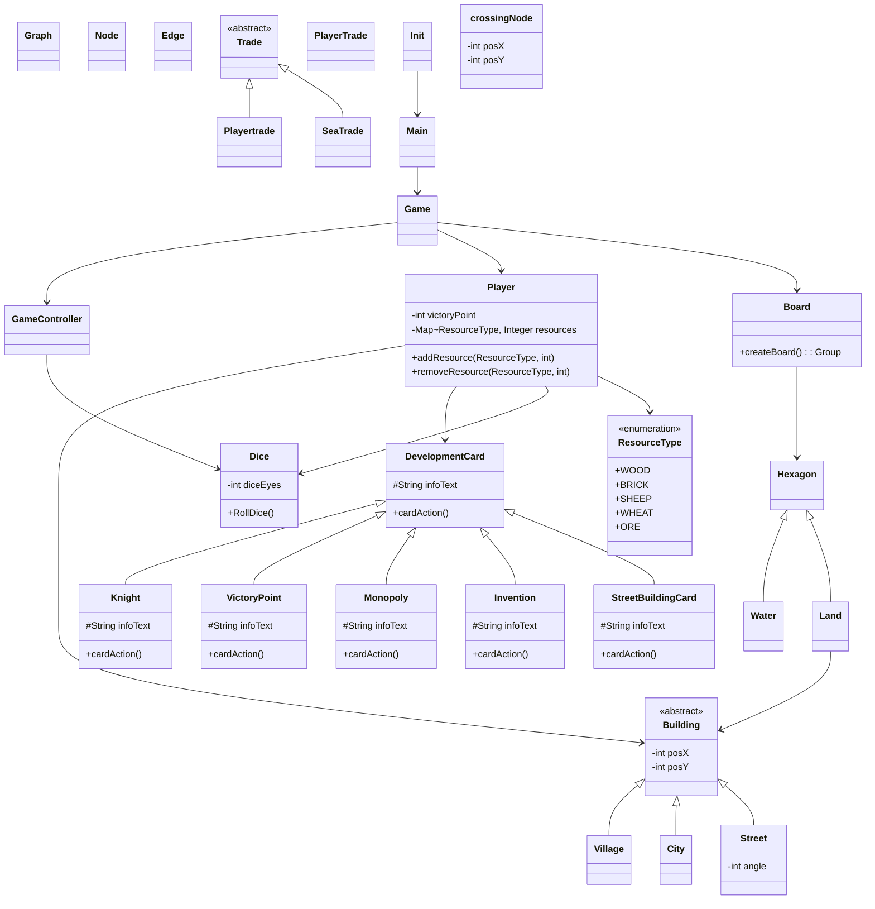

```mermaid
classDiagram
direction TB
    class Graph{

    }
    class Node{

    }
    class Edge{
      
    }

    class Trade{
      <<abstract>>
    }
    class SeaTrade{

    }
    class PlayerTrade{

    }
    class Init {
    }
    class Main {
    }
    class Game {
    }
    class ResourceType {
      <<enumeration>>
      +WOOD
      +BRICK
      +SHEEP
      +WHEAT
      +ORE
    }
    class GameController {
    }
    class Player {
      -int victoryPoint
      -Map~ResourceType, Integer resources
      +addResource(ResourceType, int)
      +removeResource(ResourceType, int)
    }
    class Board {
      +createBoard(): Group
    }
    class Hexagon {

    }
    class Water {
    }
    class Land {
    }
    class Building {
      <<abstract>>
      -int posX
      -int posY
    }
    class crossingNode {
      -int posX
      -int posY
    }
    class Village {
    }
    class Street {
      -int angle
    }
    class City {
    }
    class Knight {
      #String infoText
      +cardAction()
    }
    class VictoryPoint {
      #String infoText
      +cardAction()
    }
    class StreetBuildingCard {
      #String infoText
      +cardAction()
    }
    class Monopoly {
      #String infoText
      +cardAction()
    }
    class Invention {
      #String infoText
      +cardAction()
    }
    class Dice {
      -int diceEyes
      +RollDice()
    }
    class DevelopmentCard {
      #String infoText
      +cardAction()
    }
    DevelopmentCard <|-- Knight
    DevelopmentCard <|-- VictoryPoint
    DevelopmentCard <|-- Monopoly
    DevelopmentCard <|-- Invention
    DevelopmentCard <|-- StreetBuildingCard
    Init --> Main
    Main --> Game
    Game --> GameController
    Game --> Player
    Game --> Board
    GameController --> Dice
    Board --> Hexagon
    Hexagon <|-- Water
    Hexagon <|-- Land
    Land --> Building
    Building <|-- Village
    Building <|-- City
    Building <|-- Street
    
    Player --> Building
    Player --> DevelopmentCard
    Player --> Dice
    Player --> ResourceType
    Trade <|-- Playertrade
    Trade <|-- SeaTrade
```
