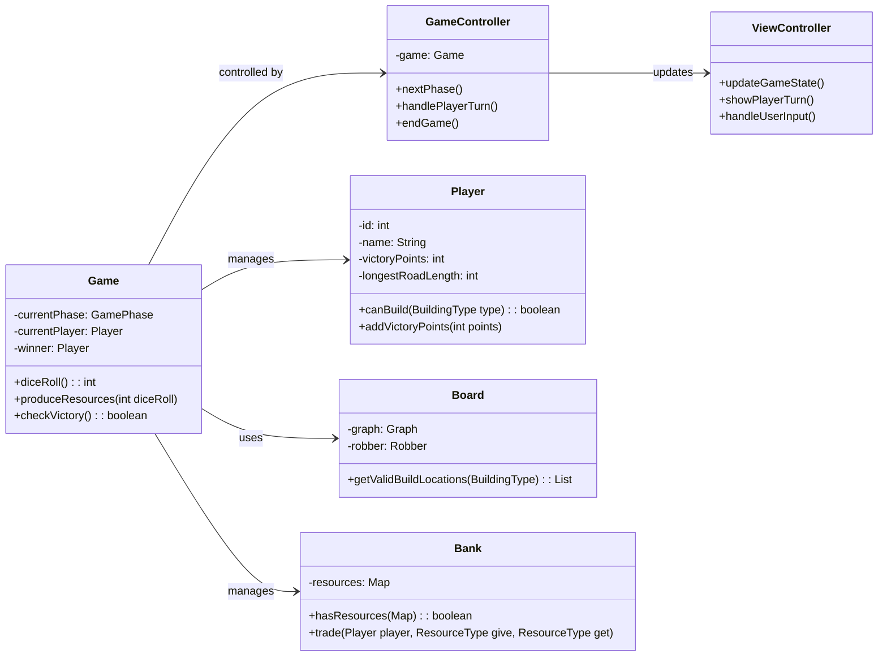
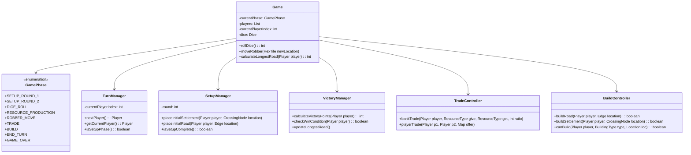
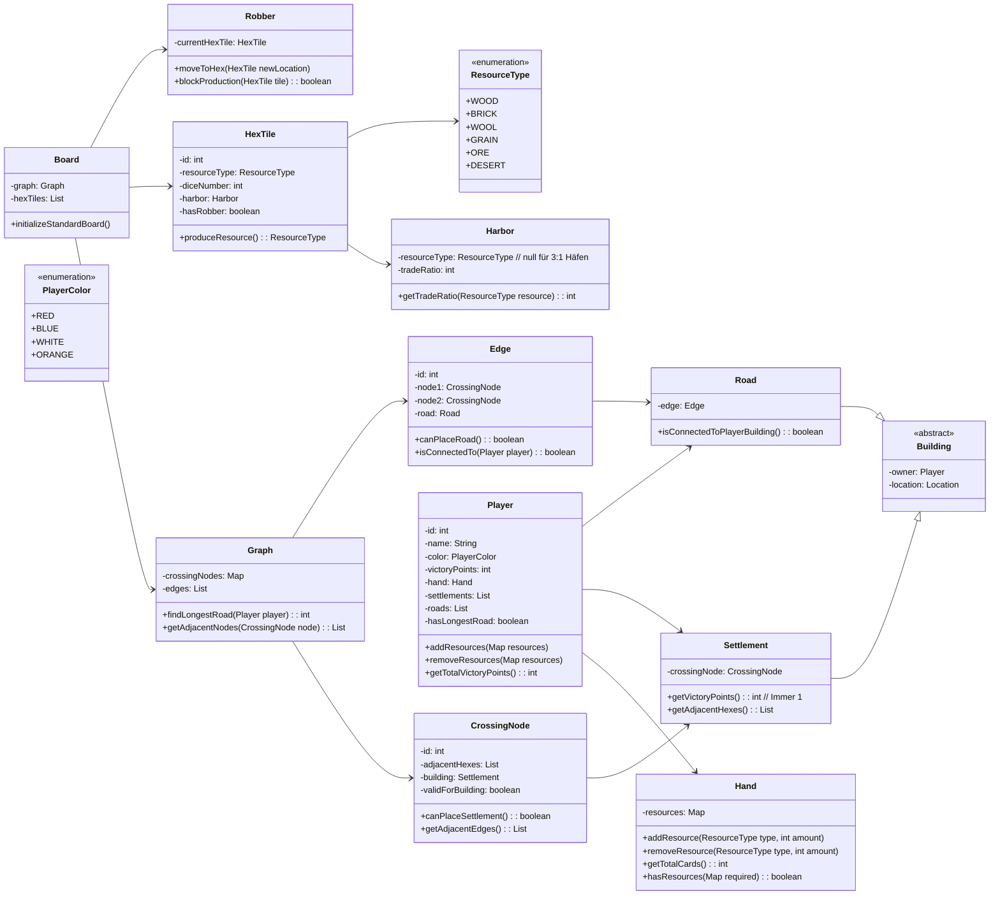
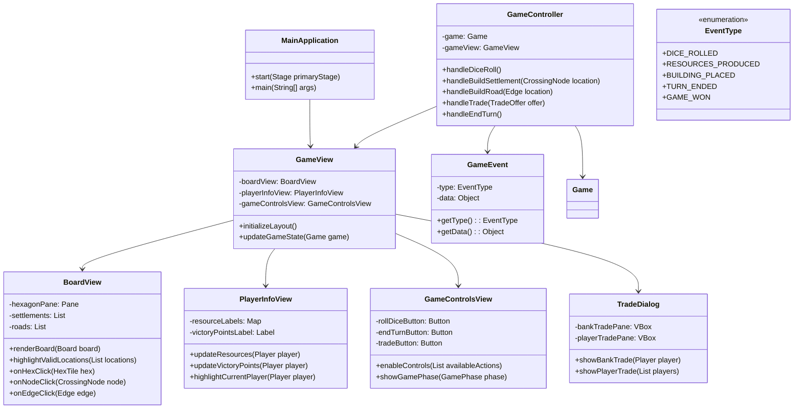
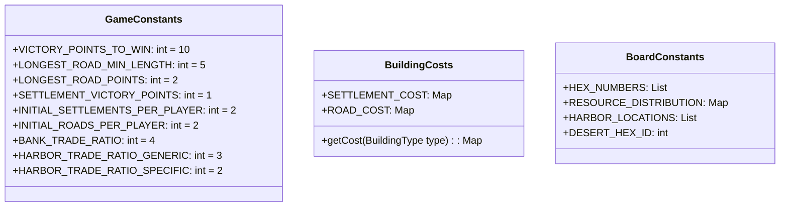

# Catan - Vereinfachte Architektur

## 1. Hauptkomponenten (vereinfacht)

## 2. Spielmechanik (ohne Entwicklungskarten)

## 3. Spielbrett und Spieler (ohne Städte)

## 4. GUI (JavaFX) - Vereinfacht

## 5. Ressourcen und Konstanten

