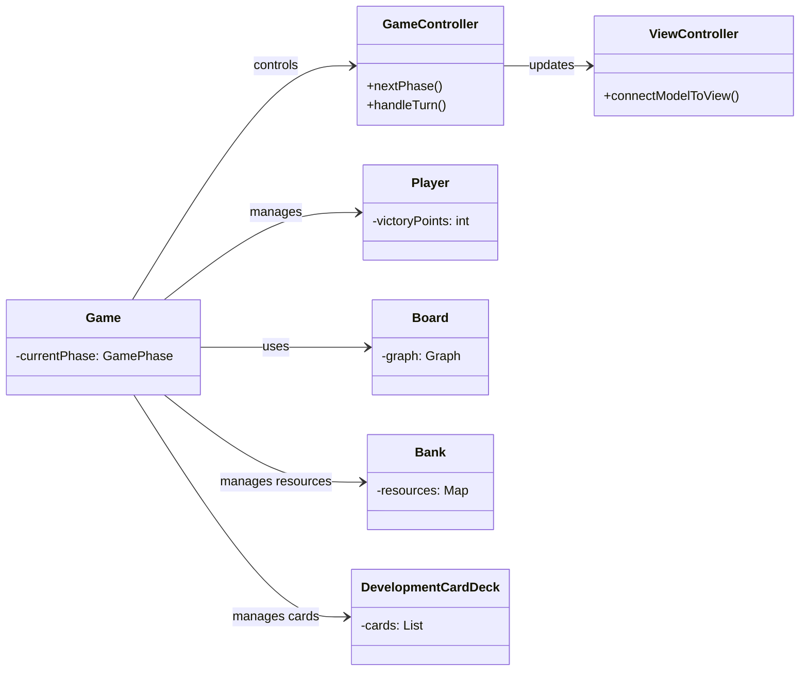
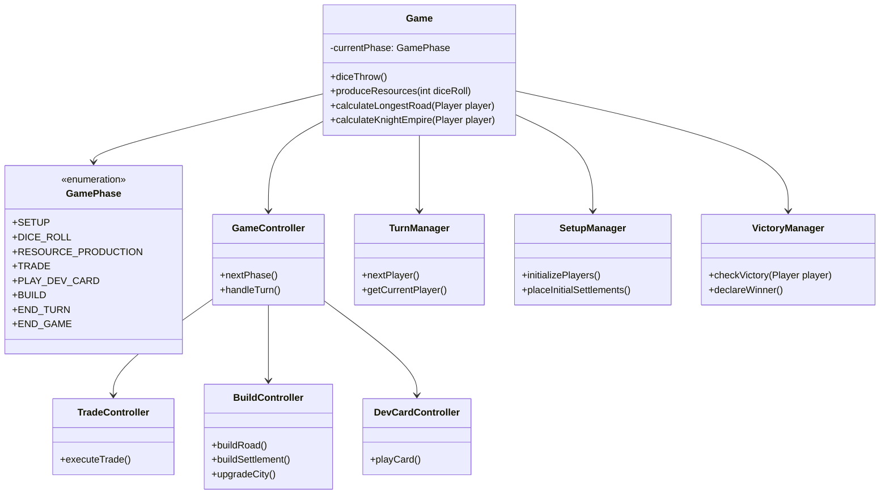
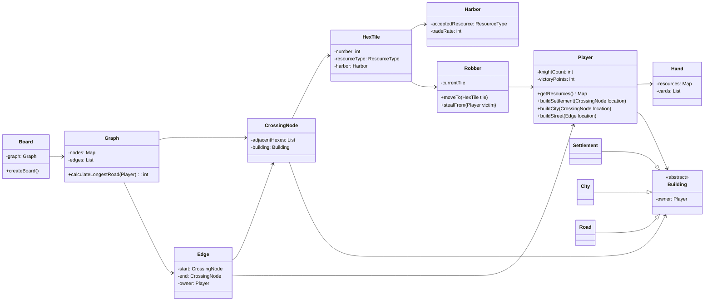
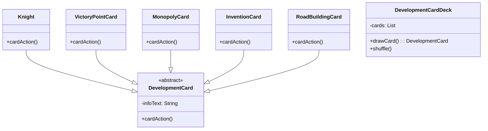
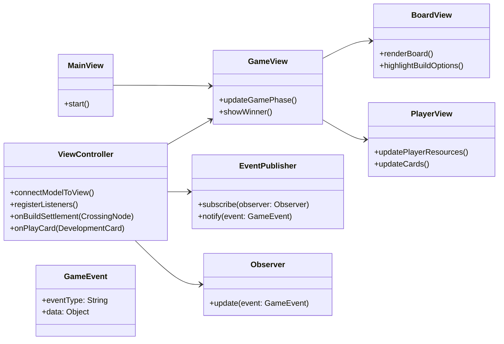

 # 1. Überblick-Diagramm (Hauptkomponenten)

```mermaid
classDiagram
direction LR

%% Hauptkomponenten
class Game {
  -currentPhase: GamePhase
}

class GameController {
  +nextPhase()
  +handleTurn()
}

class Player {
  -victoryPoints: int
}

class Board {
  -graph: Graph
}

class Bank {
  -resources: Map<ResourceType, Integer>
}

class DevelopmentCardDeck {
  -cards: List<DevelopmentCard>
}

class ViewController {
  +connectModelToView()
}

%% Beziehungen zwischen Hauptkomponenten
Game --> GameController : controls
Game --> Player : manages
Game --> Board : uses
Game --> Bank : manages resources
Game --> DevelopmentCardDeck : manages cards
GameController --> ViewController : updates
```

# 2. Subdiagramm: Spielmechanik

```mermaid
classDiagram
direction TB

%% Enumerationen
class GamePhase {
  <<enumeration>>
  +SETUP
  +DICE_ROLL
  +RESOURCE_PRODUCTION
  +TRADE
  +PLAY_DEV_CARD
  +BUILD
  +END_TURN
  +END_GAME
}

%% Spielmechanik-Klassen
class Game {
  -currentPhase: GamePhase
  +diceThrow()
  +produceResources(int diceRoll)
  +calculateLongestRoad(Player player)
  +calculateKnightEmpire(Player player)
}

class GameController {
  +nextPhase()
  +handleTurn()
}

class TurnManager {
  +nextPlayer()
  +getCurrentPlayer()
}

class TradeController {
  +executeTrade()
}

class BuildController {
  +buildRoad()
  +buildSettlement()
  +upgradeCity()
}

class DevCardController {
  +playCard()
}

class SetupManager {
  +initializePlayers()
  +placeInitialSettlements()
}

class VictoryManager {
  +checkVictory(Player player)
  +declareWinner()
}

%% Beziehungen
Game --> GamePhase
Game --> GameController
Game --> TurnManager
Game --> SetupManager
Game --> VictoryManager
GameController --> TradeController
GameController --> BuildController
GameController --> DevCardController
```
# 3. Subdiagramm: Spielbrett und Spieler

```mermaid
classDiagram
direction LR

%% Spielbrett-Klassen
class Board {
  -graph: Graph
  +createBoard()
}

class Graph {
  -nodes: Map<int, CrossingNode>
  -edges: List<Edge>
  +calculateLongestRoad(Player): int
}

class CrossingNode {
  -adjacentHexes: List<HexTile>
  -building: Building
}

class Edge {
  -start: CrossingNode
  -end: CrossingNode
  -owner: Player
}

class HexTile {
  -number: int
  -resourceType: ResourceType
  -harbor: Harbor
}

class Harbor {
  -acceptedResource: ResourceType
  -tradeRate: int
}

class Robber {
  -currentTile
  +moveTo(HexTile tile)
  +stealFrom(Player victim)
}

%% Spieler-Klassen
class Player {
  -knightCount: int
  -victoryPoints: int
  +getResources() Map<ResourceType, Integer>
  +buildSettlement(CrossingNode location)
  +buildCity(CrossingNode location)
  +buildStreet(Edge location)
}

class Hand {
  -resources: Map<ResourceType, Integer>
  -cards: List<DevelopmentCard>
}

class Building {
  <<abstract>>
  -owner: Player
}

class Settlement
class City
class Road
Settlement --|> Building
City --|> Building
Road --|> Building

%% Beziehungen
Board --> Graph
Graph --> CrossingNode
Graph --> Edge
Edge --> CrossingNode
Edge --> Player
CrossingNode --> HexTile
CrossingNode --> Building
HexTile --> Harbor
HexTile --> Robber
Robber --> Player
Player --> Hand
Player --> Building
```
# 4. Subdiagramm: Entwicklungskarten

```mermaid
classDiagram
direction TB

class DevelopmentCard {
  <<abstract>>
  -infoText: String
  +cardAction()
}

class Knight {
  +cardAction()
}

class VictoryPointCard {
  +cardAction()
}

class MonopolyCard {
  +cardAction()
}

class InventionCard {
  +cardAction()
}

class RoadBuildingCard {
  +cardAction()
}

class DevelopmentCardDeck {
  -cards: List<DevelopmentCard>
  +drawCard(): DevelopmentCard
  +shuffle()
}

Knight --|> DevelopmentCard
VictoryPointCard --|> DevelopmentCard
MonopolyCard --|> DevelopmentCard
InventionCard --|> DevelopmentCard
RoadBuildingCard --|> DevelopmentCard

```
# 5. Subdiagramm: GUI (JavaFX)

```mermaid
classDiagram
direction LR

class MainView {
  +start()
}

class PlayerView {
  +updatePlayerResources()
  +updateCards()
}

class BoardView {
  +renderBoard()
  +highlightBuildOptions()
}

class GameView {
  +updateGamePhase()
  +showWinner()
}

class ViewController {
  +connectModelToView()
  +registerListeners()
  +onBuildSettlement(CrossingNode)
  +onPlayCard(DevelopmentCard)
}

class GameEvent {
  +eventType: String
  +data: Object
}

class EventPublisher {
  +subscribe(observer: Observer)
  +notify(event: GameEvent)
}

class Observer {
  +update(event: GameEvent)
}

MainView --> GameView
GameView --> BoardView
GameView --> PlayerView
ViewController --> GameView
ViewController --> EventPublisher
ViewController --> Observer
```
